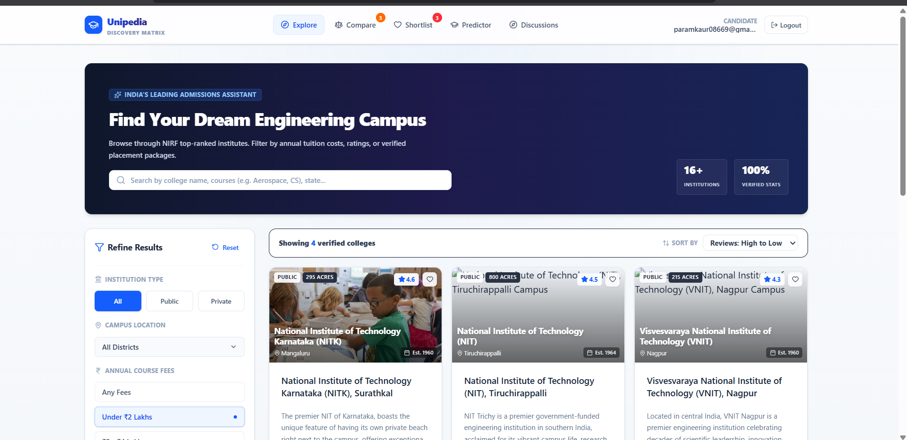
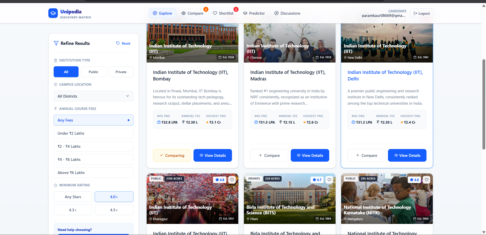
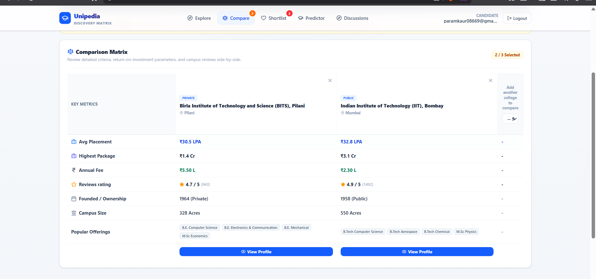

# 🎓 Unipedia — College Discovery Platform MVP

🚀 A modern full-stack College Discovery Platform inspired by platforms like **Collegedunia** and **Careers360**.

Unipedia helps students:
- 🔍 Explore engineering colleges
- ⚖️ Compare institutions side-by-side
- 💰 Analyze placements & fees
- ❤️ Save shortlisted colleges
- 📱 Access a responsive and intuitive dashboard experience

Built as a production-focused internship MVP emphasizing:
- 🧩 Clean architecture
- 📦 Scalable structure
- 🎨 Responsive UI
- ♻️ Reusable components
- ☁️ Deployment readiness

---

# 🛠️ Tech Badges


---

# 🌐 Live Demo

## 🚀 Live URL
https://college-discovery-platform-zeta-beryl.vercel.app/

## 📂 GitHub Repository
https://github.com/paramjyot2004/college-discovery-platform

---

# ✨ Features

✅ College search and filtering  
✅ Side-by-side college comparison  
✅ Save favorite colleges  
✅ College detail pages  
✅ Responsive dashboard UI  
✅ Authentication system  
✅ Pagination and sorting  
✅ REST API architecture  
✅ Loading and empty states  
✅ Mobile responsive design  

---

# 💡 Why This Project?

Students often struggle to compare colleges efficiently across multiple education portals.

Unipedia was built to simplify college discovery through a modern search, filtering, and comparison experience focused on usability, scalability, and performance.

---

# 📸 Screenshots

## 🏠 Explore Page



---

## 🏫 College Detail Page



---

## ⚖️ Compare Colleges



---
---

# 🛠️ Tech Stack

| Layer | Technology |
|-------|-------------|
| 🎨 Frontend | React + Vite + TypeScript |
| 💅 Styling | Tailwind CSS |
| ⚙️ Backend | Express.js |
| 🗄️ Database | PostgreSQL / Local JSON |
| 🔗 ORM | Prisma |
| 🔐 Authentication | NextAuth.js |
| ☁️ Deployment | Vercel + Neon PostgreSQL |

---

# 🏗️ Architecture

The application uses a **React + Vite frontend** with an **Express backend** serving REST APIs.

For development, a lightweight local JSON database is used for fast iteration and sandbox compatibility.

Production-ready Prisma and PostgreSQL configurations are included for deployment using **Neon PostgreSQL** and **Vercel**.

---

# ⚡ Engineering Highlights

- 📦 Scalable folder structure
- ♻️ Reusable component architecture
- 🔍 Dynamic filtering and search system
- ⚖️ Side-by-side comparison workflow
- 📱 Mobile responsive dashboard
- 🗄️ Prisma ORM integration
- 🔐 Authentication-protected saved colleges
- ☁️ Deployment-ready architecture

---

# 📁 Folder Structure

```bash
├── prisma/
│   ├── schema.prisma
│   ├── seed.ts
│   └── nextauth-config.ts
│
├── server/
│   └── db.json
│
├── src/
│   ├── components/
│   │   ├── AuthModal.tsx
│   │   ├── CollegeCard.tsx
│   │   ├── CompareTable.tsx
│   │   ├── EmptyState.tsx
│   │   ├── FilterSidebar.tsx
│   │   ├── Footer.tsx
│   │   ├── LoadingSkeleton.tsx
│   │   ├── Navbar.tsx
│   │   └── Pagination.tsx
│   │
│   ├── context/
│   │   └── AuthContext.tsx
│   │
│   ├── pages/
│   │   ├── ExplorePage.tsx
│   │   ├── DetailPage.tsx
│   │   ├── ComparePage.tsx
│   │   └── SavedPage.tsx
│   │
│   ├── types.ts
│   ├── App.tsx
│   ├── index.css
│   └── main.tsx
│
├── index.html
├── package.json
├── server.ts
└── tsconfig.json
```

---

# 📡 REST API Endpoints

## 🏫 Colleges

### Get all colleges

```http
GET /api/colleges
```

### Get college details

```http
GET /api/colleges/:slug
```

### Compare colleges

```http
GET /api/compare?slugs=slug1,slug2
```

---

## 🔐 Authentication

### Register user

```http
POST /api/auth/signup
```

### Login user

```http
POST /api/auth/login
```

### Current session

```http
GET /api/auth/me
```

---

## ❤️ Saved Colleges

### Fetch saved colleges

```http
GET /api/saved-colleges
```

### Save / remove college

```http
POST /api/saved-colleges/toggle
```

---

# 🗄️ Database Models

## 👤 User
- id
- email
- password
- createdAt

## 🏫 College
- id
- name
- slug
- location
- fees
- rating
- placements
- courses
- image

## ❤️ SavedCollege
- id
- userId
- collegeId

---

# 🚀 Local Development Setup

## 📥 Clone Repository

```bash
git clone <your-repository-url>
```

## 📦 Install Dependencies

```bash
npm install
```

## ▶️ Run Development Server

```bash
npm run dev
```

Application runs at:

```bash
http://localhost:3000
```

---

# 🔑 Environment Variables

Create a `.env` file:

```env
DATABASE_URL="your-neon-postgres-url"
NEXTAUTH_SECRET="your-secret"
NEXTAUTH_URL="http://localhost:3000"
```

---

# 🧬 Prisma Setup

## Push Database Schema

```bash
npx prisma db push
```

## Seed Database

```bash
npx tsx prisma/seed.ts
```

---

# ☁️ Deployment

## 🚀 Frontend Deployment

Deploy on Vercel:

https://college-discovery-plat-git-59f900-paramkaur08669-7048s-projects.vercel.app/

## 🗄️ Database Hosting

Use Neon PostgreSQL:

https://neon.tech

---

# 🧠 Engineering Decisions

This project intentionally focuses on:
- 🧩 Clean architecture
- ♻️ Reusable components
- 📦 Scalable folder structure
- 📱 Responsive UI
- ⚡ Reliable core workflows

Instead of adding unnecessary complexity, the platform prioritizes:
- 🔍 Search and filtering
- ⚖️ Comparison workflows
- 🔐 Authentication
- ☁️ Deployment stability

---

# 🔮 Future Improvements

- 🤖 AI-powered recommendations
- 📊 Real-time analytics
- 🛡️ Admin dashboard
- ⭐ College review system
- 🔔 Notification system
- 🧠 Smart search suggestions

---

# 📄 License

MIT License
